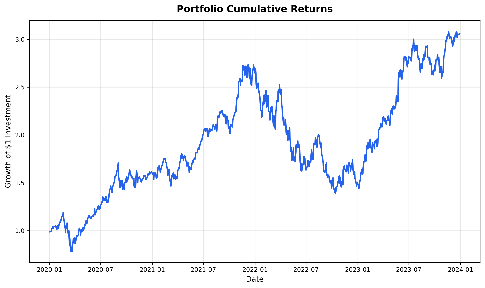
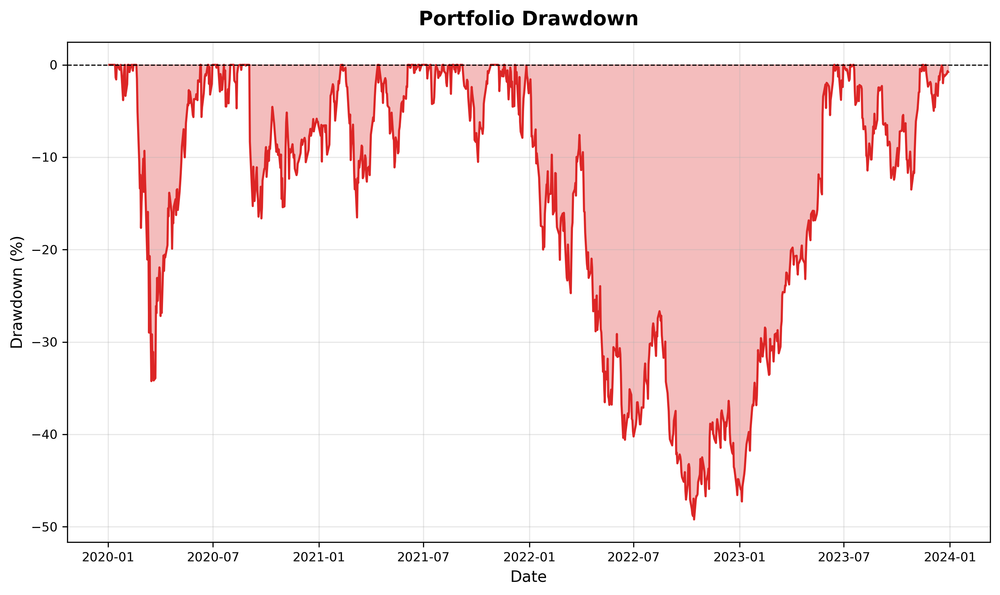
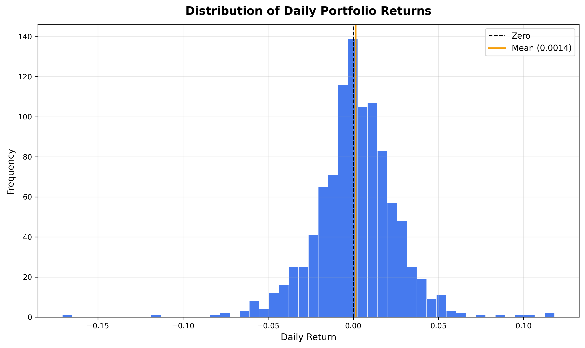

# Portfolio Risk Analyzer

A Python CLI tool for analyzing the historical risk of an investment portfolio using real market data.

Built as a learning project to practice Python applied to finance and produce a clean GitHub / LinkedIn portfolio piece.



---

## Features

- Download historical adjusted close prices via `yfinance`
- Calculate portfolio log returns and weighted aggregation
- Annualized return, volatility, and Sharpe Ratio
- Drawdown series and maximum drawdown
- Historical Value at Risk (VaR) and Conditional VaR (CVaR / Expected Shortfall)
- Worst daily returns
- Benchmark comparison and portfolio beta
- Charts saved to `outputs/`: cumulative returns, drawdown, return distribution

---

## Project Structure

```text
.
├── CLAUDE.md          # Project instructions for Claude Code
├── data_loader.py     # Downloads and cleans market price data
├── metrics.py         # Return and performance metrics
├── risk.py            # Downside and tail-risk metrics
├── benchmark.py       # Benchmark comparison and beta
├── plots.py           # Chart generation (saves to outputs/)
├── main.py            # CLI entry point
├── outputs/           # Generated charts (git-ignored)
├── requirements.txt   # Python dependencies
└── README.md
```

---

## Installation

```bash
python -m venv .venv
source .venv/bin/activate      # Windows: .venv\Scripts\activate
pip install -r requirements.txt
```

---

## Usage

```bash
python main.py \
  --tickers AAPL MSFT NVDA \
  --weights 0.3 0.3 0.4 \
  --start 2020-01-01 \
  --end 2024-01-01 \
  --risk-free-rate 0.02 \
  --benchmark SPY
```

---

## Current Status

**All phases complete — fully functional CLI tool.**

| Phase | Description              | Status |
|-------|--------------------------|--------|
| 1     | Project skeleton         | Done   |
| 2     | Data loading             | Done   |
| 3     | Portfolio metrics        | Done   |
| 4     | Risk metrics             | Done   |
| 5     | Benchmark analysis       | Done   |
| 6     | Plotting                 | Done   |
| 7     | CLI integration          | Done   |
| 8     | README polish            | Done   |

---

## Tech Stack

- Python 3.10+
- pandas
- numpy
- matplotlib
- yfinance
